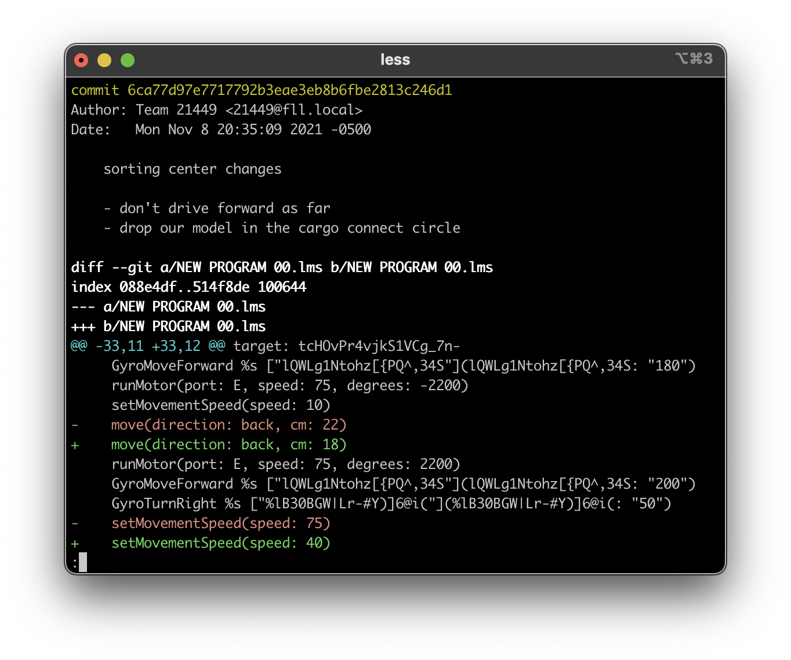

# Mind Meld - inspect LEGO Mindstorms Scratch programs

`mind-meld` exists to help you see what's changed in your Mindstorms programs. One common use-case is with `.lmsp` or `.lms` programs that are versioned with Git. In this case, `mind-meld` can help you see what changed in each commit.

## View diffs with mind-meld

In your repository, add this to `.gitattributes` and check it in.

    *.lms diff=mind-meld
    *.lmsp diff=mind-meld

On your computer, install mind-meld and set up mind-meld's git diff tool.

    $ go install github.com/spraints/mind-meld@latest # or download a release
    $ git config --global diff.mind-meld.textconv 'mind-meld git-diff'

Now, git log will look like this:

